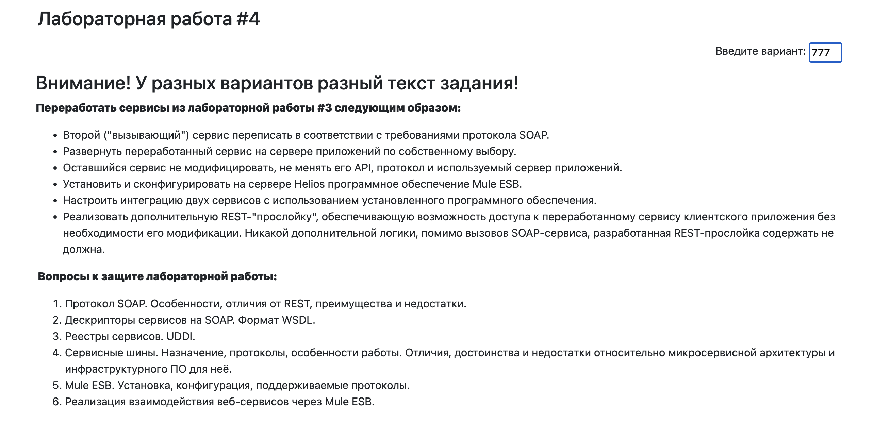

# Лабораторная работа №2
По предмету: Сервис-ориентированная архитектура

Вариант: 444

Выполнили:
- Мальков Павел
- Касымов Тимур

Группа: P3410

## Задание

# Лабораторная работа №2
По предмету: Сервис-ориентированная архитектура

Вариант: 444

Выполнили:
- Мальков Павел
- Касымов Тимур

Группа: P3410

## Задание

# Лабораторная работа №3
По предмету: Сервис-ориентированная архитектура

Вариант: 777

Выполнили:
- Мальков Павел
- Касымов Тимур

Группа: P3410

## Задание

